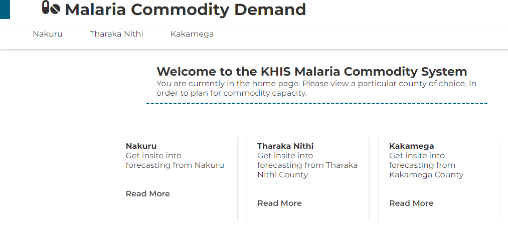
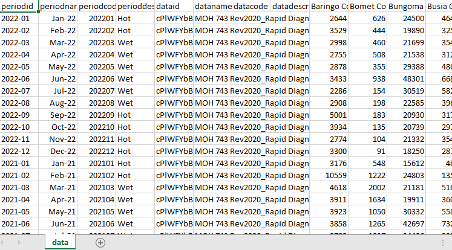
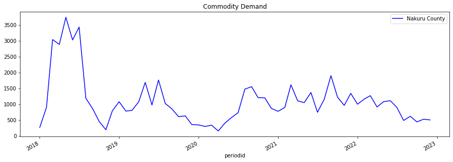
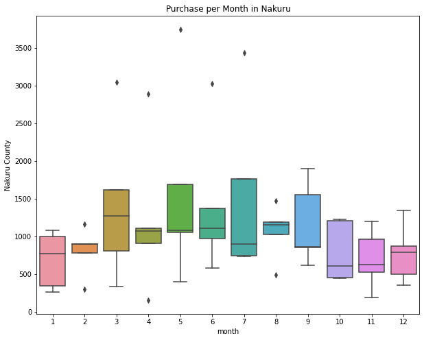
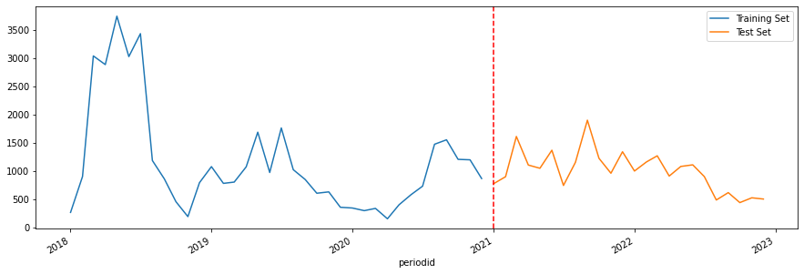
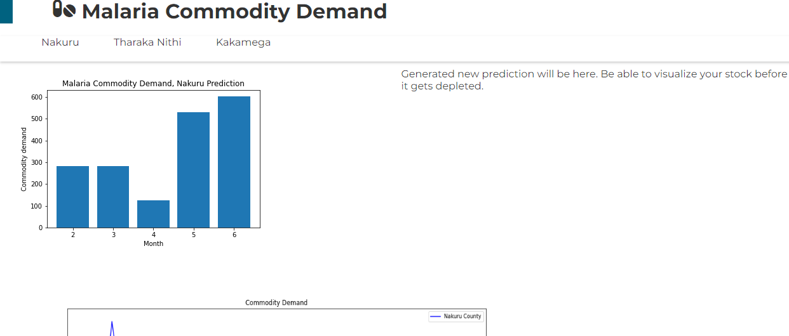

 
# Malaria Commodity Prediction
### An Application of Time Series with Extreme Gradient Boosting Algorithm

HealthIT Data Science Hackathon

Work Presented by The Blue Neon Group
* Theophilus Lincoln Owiti
* Mercy Mburu
* Teresa Chebet
* Ian Kiprotich
* Pleasant View

# Business Logic 
Tracking and restocking of Malaria commodities is currently done on the basis of 6-month averages 
computed by MoH officials from the KHIS system data. The averages utilized are not efficient in 
projecting a clear and desired picture of trends related to consumption such as seasonality, increases or 
decreases as well as other confounding factors. 
KHIS through a representative shares problems that they have faced in trying to use the averages in 
restocking Malaria commodities. The representative showed a system based of KHIS and desired the 
same predictive outcome instead of the averages projected to create and efficient way of making 
decisions to restock Malaria commodities amidst demand. 
Need of client 
Therefore, KHIS needs a Time Analysis Predictive model that is able to monitor common patterns and 
trends and give our projections of what is expected as per areas of low demand and areas of high 
demand in order to have efficient restocking of Malaria commodities.

# Data Acquisition
Data is derived from the KHIS System that generates 6-month seasonal averages. The team asked for 
data from the KHIS System where it was then provided. The nature of the data received was in the form 
of a CSV file that pertained of the years between 2018 to 2022, each of these years with their monthly 
demand for each county in Kenya. The data set projected a period of about 5 years. 

# Data Exploration & Analysis
In efforts to understand the big picture behind the demand for the above-mentioned commodity 
demand in Kenya. Power BI was utilized to visualize the overall occurrence of demands.

Model counties were appropriate to be chosen and Nakuru was a county of interest. The question that 
revolves around one’s mind is that what was the current trend of Malaria for about 5 years in Nakuru? 

From the data trend we observe that: 
* Between 2018 – 2019, there was a sharp rise of Malaria in Nakuru County and the middle of 
2018 there was the highest spike. This conclusion is based on the fact that more Malaria 
commodities were on demand. The outbreak of Malaria in Nakuru at this time might have been 
due to most people not sleeping under a mosquito net and proper drainage to discourage 
breeding of mosquitoes were not destroyed as required. 
* Approximately 4 months towards the end of the year there was a sharp decline in demand and 
then a steady fall and in the last 2 months a steady increase occurred but lower than in the 
middle of the year. 
* Same trend followed in 2019 but with lower Malaria commodity demand. This means that if the 
government was holding awareness campaigns on Malaria it means that the campaigns had 
started taking shape in sensitizing people against Malaria. 
* Up to 2022 a prominent trend of spikes in the middle of the year occurs but at lower rates than 
in 2018. 
* The seasonal trend becomes spikes in the middle of the year and this can be attributed to the 
fact that spikes occur due to rainy period that encourage breeding of mosquitoes due to 
stagnant water that is usually present at this time. 
* Also, the spikes are rampant towards June/July. But commodity demand has lowered over the 
years. 

### From the generation of features after doing out time analysis. An interesting fact comes out in terms of trends that occur in each month in Nakuru per month.

As we have determined it is March or May that demand gets up this can be due to the wet conditions 
that occur at that time and following the box plot it shows between July to October there is still a fairly 
significant rise in demand. 
It therefore important that most restocking should be done starting early as March to avoid havoc 
during high spikes. It is important to note that the spikes are not uniform but the largest effect starts at 
around March.

# Data Cleaning
After doing a quick analysis of the data, during cleaning the CSV file: 
* We use pandas to check for null values using the isnull() function. 
* We then use dropna() to drop the null values that are present in our data. 
* If our values are needed we fill them in with averages. 
All this is possible through the pandas library. 

# Feature Engineering
It is first of all important to do a time analysis where we have informed decision on which features/ 
variables we want to use. Then we use pandas to index our data according to the datetime after 
changing the first column- “periodid” to datetime datatype. Before this we can do a small test in our 
notebook to test for stationarity of our data. 

In a trial Python notebook, an Analysis of the data is done to find out if the trend present has an aspect 
of stationarity. We use the rolling mean and rolling standard deviation to vaguely determine if our data 
is stationary from a graph. To see if the trends that we have are consistent throughout the seasons we 
have. In this instance we use Python’s Statmodel. 
From statsmodel we import dickey fuller test and use it to see the metrics and determine the nature of 
our data and give us our p-values of the data and tells us about our stationarity condition. 
In the official notebook we then do a split for the test and train data. At this point it is wise not to use 
random split as we are dealing with a time series therefore we will use a range from the most recent 
years from 2021 as our test data set and early years as out train dataset. At this point we will split it 
using pandas loc() method.

We then go ahead and generate our features; we would now take from the indexed data the year and of 
course the months to determine seasonality. 

# Model Development
Several models were used to test for proper prediction based on the new features we have adopted 
from our indexed dataset. The Machine Learning models of choice were: Linear Regression with 
TensorFlow Neural Networks using Sequential Layers, Gradient Boost Regressor and lastly Extreme 
Gradient Boosting. 
Linear Regression resulted into large MSE Error and did not fit any of the curves in an optimal way and 
performed immensely poor during regularization with new data. Gradient Boost Regressor resulted into 
continuous underfitting and large RMSE and MSE Errors and had poor regularization that projected 
impossible values even after adding an appropriate learning rate and proper number of boosted trees. 
Extreme Gradient Boosting resulted into acceptable regularized values that gave an error of about RMSE 
of 500 and an observation of overfitting was observed at the point of cross-validation data set. At this 
point a number of trees were reduced and an appropriate learning rate was adopted for proper 
learning. After a doing all checks to make the algorithm work better it was therefore concluded it fit the 
curve as proposed. 
The Algorithm was derived from xgboost library in python and incorporated as a function with relevant 
parameters for optimal performance. 

# Model Evaluation
We first of all see the importance of the features that we used and the pandas provides this 
functionality as shown in Figure 6.0. 

We use this model to predict the test dataset and the graph shows how the prediction does. The 
prediction is not as effective as expected due to the data barriers faced and distribution. The major 
factors that affect the graph are the amount of data and the distribution of our data.

Summary: 
The metrics that was used for our model was the Root Mean Squared Error (RMSE) and Mean Squared 
Error (MSE), important thing to note is that the Regressor uses RMSE only by default because of the 
inconsistencies. 
In accordance with the features, this terms quarter prediction as an inaccurate strategy for prediction of 
commodities. Meanwhile, the month features make it to the spot light as the highest importance. 
We used a pandas feature that allows us to compute the importance of the features that we are to use 
for plotting. 
XGBR is a Regression Model that works by building ensemble of decision trees, where each tree is 
trained to make prediction based on a subset of the available data. The final prediction is made by 
taking the average of the prediction from all the trees in the ensemble. 
It was the used model as it worked better as compared to the others and the over-fitting was easier to 
identify using the cross-validation function.

# Model Deployment
The main strategy for deploying the model was to create a python module and use an local deployment 
then later on implement a flask deployment using proper routes to do county predictions and give out 
desired prediction that are appropriate for restocking. 
Later recommendation is to use Azure Data Pipelines and create a model endpoint that can interact with 
an application API in order to give proper projections. 

# Challenges & Recommendation 
* There was insufficient data leading to inaccurate predictions. 
* There was a challenge in time where the Deployment phase needed a lot of testing. 
* Insufficient time to properly understand the data since the data is the core of the model.

